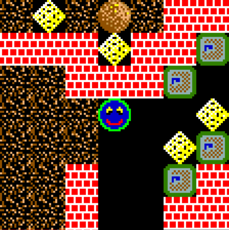

# WinColl

WinColl is a simple action puzzle game in which you tunnel through caverns collecting diamonds while avoiding being squashed by falling rocks.

[Installers](https://github.com/rrthomas/wincoll/releases/latest) are provided for:

+ [GNU/Linux](https://github.com/rrthomas/wincoll/releases/latest/download/wincoll-Linux-X64)
+ [macOS](https://github.com/rrthomas/wincoll/releases/latest/download/wincoll-macOS-ARM64.dmg)
+ [Windows](https://github.com/rrthomas/wincoll/releases/latest/download/wincoll-win64.msi)
+ [RISC OS](https://github.com/rrthomas/wincoll/releases/latest/download/wincoll-riscos.zip)

For more information, including how to design your own levels, see the [development page](https://github.com/rrthomas/wincoll).

## Copyright and Disclaimer

WinColl is distributed under the [GNU Public License version 3](https://www.gnu.org/licenses/gpl-3.0.html), or, at your
option, any later version. That means it is free to copy, share, remix and improve!

## Credits

Paul Smith designed the title graphics, and Alistair Turnbull helped with the game graphics.

Level design by Alistair Turnbull, Paul Wilson, Reuben Thomas, Paul Smith, Jeremy Douglas and Daniel Thomas.

The sounds are from [Freesound](https://freesound.org).
